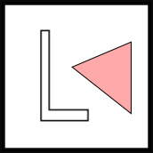

# Un lenguaje que vale más que mil dibujos #

Este lab propone la implementación de un lenguaje pequeño específico para una
tarea muy concreta: combinar dibujos básicos para crear diseños más
interesantes. A este tipo de lenguajes se los suele conocer como DSL (Domain
Specific Language: lenguaje de dominio específico) porque están pensados para
eso: proveer abstracciones adecuadas para resolver problemas acotados a cierto
ámbito. La idea original del lenguaje está en este
[artículo](https://cs.famaf.unc.edu.ar/~mpagano/henderson-funcgeo2.pdf "en
inglés") de Peter Henderson, que recomendamos leer.

Para definir un lenguaje necesitamos dos cosas: su _sintaxis_ ---cómo
lo vamos a escribir---, y su _semántica_ ---cómo lo vamos a
interpretar. Por ejemplo, en el lenguaje que vamos a ver vamos a poder
escribir un operador de rotación, que lo interpretaremos como la
rotación de una imágen. Esta interpretación estará dada en nuestro
caso por una función que transforma los programas del DSL en otras
cosas; estas cosas pueden ser elementos de otros tipos o también
_efectos_, como mostrar algo por la pantalla, escribir algo en un
archivo, enviar paquetes por alguna interfaz de red, etc.

## La tarea ##

Implementar un DSL para especificar la composición de dibujos
geométricos. Un lindo ejercicio del artículo de Henderson es una
figura de Escher, que consta de la superposición de una figura
repetida y alterada hasta formar una composición compleja. Junto con
el DSL se debe definir su semántica usando una biblioteca de gráficos
(por ejemplo Gloss o diagrams).

### El lenguaje  ###

Nuestro lenguaje está parametrizado sobre una colección de figuras básicas
(representado por el no terminal `<Bas>`) y contiene _instrucciones_ para rotar
la imagen 90 grados, para espejarla horizontalmente, para rotarla 45 grados
(reduciendo su tamaño al mismo tiempo) y para combinar figuras. `Apilar` pone la
primer figura encima de la segunda, mientras que `Juntar` las coloca al lado;
estas dos instrucciones toman un par de enteros que indican la proporción del
tamaño de la primera y la segunda figura.

```
<Fig> ::= Basica <Bas> | Rotar <Fig> | Espejar <Fig> | Rot45 <Fig>
    | Apilar <Int> <Int> <Fig> <Fig> 
    | Juntar <Int> <Int> <Fig> <Fig> 
    | Encimar <Fig> <Fig>
```

Usando este lenguaje podemos definir en Haskell funciones que combinan
programas `<Fig>` para producir otros. Usualmente esas funciones se
llaman _combinadores_. Por ejemplo, `rotar180 <Fig>` se define
fácilmente como la composición de `Rotar` con `Rotar`.

La semántica formal de las figuras básicas es una función que toma tres
vectores _a, b, c_ en ℝ² y produce una figura bi-dimensional donde
_a_ indica el desplazamiento del origen, _b_ el ancho y _c_ el alto.

### El lab propiamente dicho ###

Su tarea consistirá en dar las definiciones necesarias para operar
e interpretar figuras del estilo de `<Fig>`.

#### El lenguaje ####

- Definir el lenguaje como un tipo de datos: como no sabemos a priori qué
  figuras básicas tendremos, nuestro tipo de figuras debe ser _polimórfico_.

- Definir los siguientes combinadores:

```haskell
-- Composición n-veces de una función con sí misma.
comp :: (a -> a) -> Int -> a -> a

-- Rotaciones de múltiplos de 90.
r180 :: Dibujo a -> Dibujo a
r270 :: Dibujo a -> Dibujo a

-- Pone una figura sobre la otra, ambas ocupan el mismo espacio.
(.-.) :: Dibujo a -> Dibujo a -> Dibujo a

-- Pone una figura al lado de la otra, ambas ocupan el mismo espacio.
(///) :: Dibujo a -> Dibujo a -> Dibujo a

-- Superpone una figura con otra.
(^^^) :: Dibujo a -> Dibujo a -> Dibujo a

-- Dadas cuatro figuras las ubica en los cuatro cuadrantes.
cuarteto :: Dibujo a -> Dibujo a -> Dibujo a -> Dibujo a -> Dibujo a

-- Una figura repetida con las cuatro rotaciones, superpuestas.
encimar4 :: Dibujo a -> Dibujo a 

-- Cuadrado con la misma figura rotada i * 90, para i ∈ {0, ..., 3}.
-- No confundir con encimar4!
ciclar :: Dibujo a -> Dibujo a
```

- Definir esquemas para la manipulación de figuras básicas.
```haskell
-- Ver un a como una figura.
pureDib :: a -> Dibujo a

-- map para nuestro lenguaje.
mapDib :: (a -> b) -> Dibujo a -> Dibujo b

-- Verificar que las operaciones satisfagan:
-- 1. mapDib id = id, donde id es la función identidad.
-- 2. mapDib (g ∘ f) = (mapDib g) ∘ (mapDib f).

-- Estructura general para la semántica (a no asustarse). Ayuda: 
-- pensar en foldr y las definiciones de intro a la lógica
sem :: (a -> b) -> (b -> b) -> (b -> b) -> (b -> b) ->
       (Int -> Int -> b -> b -> b) -> 
       (Int -> Int -> b -> b -> b) -> 
       (b -> b -> b) ->
       Dibujo a -> b
```

- Usando los esquemas anteriores, es decir no se puede hacer
pattern-matching, definir estas funciones:

```haskell
type Pred a = a -> Bool

-- Dado un predicado sobre básicas, cambiar todas las que satisfacen
-- el predicado por la figura básica indicada por el segundo argumento.
cambiar :: Pred a -> a -> Dibujo a -> Dibujo a

-- Alguna básica satisface el predicado.
anyDib :: Pred a -> Dibujo a -> Bool

-- Todas las básicas satisfacen el predicado.
allDib :: Pred a -> Dibujo a -> Bool

-- Los dos predicados se cumplen para el elemento recibido.
andP :: Pred a -> Pred a -> Pred a

-- Algún predicado se cumple para el elemento recibido.
orP :: Pred a -> Pred a -> Pred a

-- Describe la figura. Ejemplos: 
--   desc (const "b") (Basica b) = "b"
--   desc (const "b") (Rotar (Basica b)) = "rot (b)"
--   desc (const "b") (Apilar n m (Basica b) (Basica b)) = "api n m (b) (b)"
-- La descripción de cada constructor son sus tres primeros
-- símbolos en minúscula, excepto `Rot45` al que se le agrega el `45`.
desc :: (a -> String) -> Dibujo a -> String

-- Junta todas las figuras básicas de un dibujo.
basicas :: Dibujo a -> [a]
```

- Definir los siguientes predicados (pueden hacer pattern-matching).
  Estos predicados indican una superfluocidad de operaciones (es
  decir, cambian para no cambiar nada).

```haskell
-- Hay 4 rotaciones seguidas.
esRot360 :: Pred (Dibujo a)

-- Hay 2 espejados seguidos.
esFlip2 :: Pred (Dibujo a)
```

- Definición de función que aplica un predicado y devuelve 
  un error indicando fallo o una figura si no hay tal fallo.

```haskell
data Superfluo = RotacionSuperflua | FlipSuperfluo

-- Aplica todos los chequeos y acumula todos los errores, y
-- sólo devuelve la figura si no hubo ningún error.
check :: Dibujo a -> Either [Superfluo] (Dibujo a)
```

#### La interpretación geométrica ####

Se debe completar o modificar el archivo `Interp.hs` para que utilice
una biblioteca para generar gráficos, e interprete las figuras en
ésta. Se recomienda
[`gloss`](http://hackage.haskell.org/package/gloss) pero pueden usar
otra (ver al final para instalar `gloss`).

```haskell
-- Suponemos que la biblioteca provee el tipo Vector y Picture.
type Output a = a -> Vector -> Vector -> Vector -> Picture
interp :: Output a -> Output (Dibujo a)
```

Supongamos que tenemos funciones _f, g_ que producen la siguientes
figuras dado un desplazamiento al origen _x_, un ancho _w_ y un alto _h_:

|                     | figura                                 |
|:--------------------|:---------------------------------------|
| _f(x, w, h)_        |    |
| _g(x, w, h)_        |        |

La semántica de cada operación de nuestro lenguaje está dada por la siguiente
tabla, donde se debe interpretar a _func(f)(x, w, h)_ al efecto de interpretar
la función matemática _func_ (que se corresponde a uno de nuestros constructores) sobre la figura _f_, en los parámetros _x, w, h_:

| Operacion                  | Semántica                                | Visualmente | 
|:---------------------------|:-----------------------------------------|:------------|
| _rotar(f)(x, w, h)_        | _f(x+w, h, -w)_                        |       |
| _rot45(f)(x, w, h)_        | _f(x+(w+h)/2, (w+h)/2, (h-w)/2)_       |      |
| _espejar(f)(x, w, h)_      | _f(x+w, -w, h)_                        |         |
| _encimar(f,g)(x, w, h)_    | _f(x, w, h) ∪ g(x, w, h)_              |         |
| _juntar(n, m, f, g)(x, w, h) con n=m/2_ | _f(x, w', h) ∪ f'(x+w', r'*w, h) con r'=n/(m+n), r=m/(m+n), w'=r*w_   |    |
| _apilar(f)(x, w, h)_       | _f(x + h', w, r*h) ∪ h(x, w, h') con r' = n/(m+n), r=m/(m+n), h'=r'*h_  |    |

Se recomienda fuertemente realizar dibujitos para comprender las operaciones.

#### Usos ####

La primer tarea es reconstruir el gráfico de Escher (con
triángulos). Para eso se debe crear un módulo `Escher.hs` en `/Basica`
donde definen un sínonimo de tipos adecuado e implementan los
siguientes combinadores, en función de la siguiente descripción de los
dos primeros niveles:

_lado(1, f) = cuarteto(blank, blank, rot(f), f)_

_lado(2, f) = cuarteto(lado(1, f), lado(1, f), rot(f), f)_

_esquina(1, f) = cuarteto(blank, blank, blank, dibujo_u(p))_

_esquina(2, f) = cuarteto(esquina(1, f), lado(1, f), rot(lado(1, f)), dibujo_u(f))_

Para esto también necesitan las figuras _u_ y _t_ del paper de Henderson, que
nosotros las generalizamos un poco, en azul se muestra la figura original.


| figura _t_                                   | figura _u_                                   |
|:--------------------------------------------:|:--------------------------------------------:|
|  |  |

Ya estamos cerca de completar el proceso, necesitamos un combinador para nueve piezas:


Finalmente podemos definir:

_escher(n, f) = noneto(…)_, donde en **P** va _esquina(n, f)_ y en **Q**
va _lado(n, f)_, el resto de las letras deben resolverlas ustedes.

```haskell
-- Supongamos que eligen.
type Escher = Bool

-- El dibujoU.
dibujoU :: Dibujo Escher -> Dibujo Escher
dibujoU p = undefined 

-- El dibujo t.
dibujoT :: Dibujo Escher -> Dibujo Escher
dibujoT p = undefined 

-- Esquina con nivel de detalle en base a la figura p.
esquina :: Int -> Dibujo Escher -> Dibujo Escher
esquina n p = undefined

-- Lado con nivel de detalle.
lado :: Int -> Dibujo Escher -> Dibujo Escher
lado n p = undefined

-- Por suerte no tenemos que poner el tipo!
noneto p q r s t u v w x = undefined

-- El dibujo de Escher:
escher :: Int -> Escher -> Dibujo Escher
escher = undefined
```

Para verlo, pueden usar la función ```desc``` e interpretar la
descripción.

#### Ver el gráfico ####

Repasemos los tres componentes de nuestro lab: (i) el lenguaje, (ii)
la interpretación geométrica, y (iii) los usos de nuestro lenguaje
(por ahora sólo uno, reconstruir el gráfico de Escher). En ningún caso
estamos produciendo ningún comportamiento, simplemente generamos
valores de tipos más o menos concretos; a algunos los podemos
representar como `String`. Es medio obvio que nos gustaría poder
mostrar en la pantalla nuestros dibujos.  Para eso necesitamos lidiar
con la entrada/salida.

Como quizás ya saben, la forma en que se estructura la interacción en
Haskell es a través de la _mónada_ de `IO`. No nos preocupemos por qué
es una mónada ~~(para eso pueden hacer el curso de Beta)~~, nos basta
con saber que la librería `gloss` nos ofrece una interfaz cómoda para
eso.

Una ventaja de Haskell es la clara separación de responsabilidades: para
resolver un problema en general debemos centrarnos en la solución _funcional_
del mismo y lo más probable es que no necesitemos IO (excepto por cuestiones de
eficiencia, quizás). Una vez que tenemos resuelto el problema (en nuestro caso
los componentes que mencionamos más arriba), podemos armar un componente más
para la IO.

En nuestro caso, lo que tenemos que realizar es utilizar la función apropiada
de `gloss`:

```haskell
display :: Display -> Color -> Picture -> IO ()
```

Hay dos alternativas para el primer argumento: una ventana (que podemos definir
con `InWindow "titulo" (width, height) (x0, y0)`), o pantalla completa
(`FullScreen`). El segundo es el color de fondo y el último argumento es la
figura a mostrar. El resultado es una _computación_ en la mónada de IO. Para
ejecutar nuestro programa debemos tener una función `main`:

```haskell
win = InWindow "Paradigmas" (200, 200) (0, 0)
main :: IO ()
main = display win white $ circle 100
```

#### Qué debe haber en el repositorio  ####

El contenido mínimo del repositorio debería ser el siguiente:

```
README.md        # Un readme breve donde comentan su experiencia y responden las 
	             # preguntas que están a continuación. Indicar acá si usan otra biblioteca.
Dibujo.hs        # Tipo de datos para <Figura> y todas las funciones
                 # relacionadas
Interp.hs        # Interpretación geométrica de las figuras, está bien
                 # si hay figuras que pueden servir para diferentes <Basica>
Basica/Escher.hs # Definición de combinadores, elección de tipo para 
                 # instanciar Dibujo, definción de la interpretación de 
                 # todas las figuras básicas.
Basica/Extra.hs  # Si se copan y hacen otros diseños, que estén en el
                 # directorio Basica.
Main.hs          # Definición del programa, configuración de parámetros.
```

#### Preguntas ####

Las siguientes preguntas deben ser respondidas correctamente, con el mayor grado
de precisión y claridad que puedan.

 1. a) ¿Por qué están separadas las funcionalidades en los módulos indicados?
    Explicar detalladamente la responsabilidad de cada módulo.
	
	b) ¿Harían alguna modificación a la partición en módulos dada?
    Justificar. Advertencia: Si hacen una buena partición, se las chorearemos
    para el año que viene.

 2. ¿Por qué las funciones básicas no están incluidas en la definición del
    lenguaje, y en vez es un parámetro del tipo?
	
 3. Explique cómo hace `Interp.grid` para construir la grilla, explicando cada
    pedazo de código que interviene.

	
#### Qué se evalúa y puntos extras ####

No se evaluarán proyectos que no se puedan compilar. La idea es que ningún
grupo llegue a este punto al momento de la entrega: pregunten temprano para
evitar esto. Hint: no intenten compilar al final. Como deben committear seguido, asegúrense que cada commit compile.

 * Que la elección de los tipos de datos sea la adecuada; en programación
   funcional esto es clave.

 * Que se comprendan los conceptos de funciones de alto orden y la forma en que
   se combinan funciones.

 * Que se haga buen reuso de funciones, es decir, que no reinventen una
   solución cada vez que se presente un mismo problema.

 * Que se pueda adaptar fácilmente a otros usos; en algún momento, antes de la
   entrega, liberaremos un archivo `Basica/Feo.hs` que use `Dibujo.hs` e
   `Interp.hs` que les permita testear.

 * Que el código sea elegante: líneas de tamaño razonable, buen espaciado, consistencia.

Se consiguen puntos extras si:

 * Hacen otra figura interesante, como una imagen fractal, explicando cada paso
   de su construcción.

 * Extienden el lenguaje para indicar animaciones de figuras. Hagan esto en un
   branch separado y comenten en el `README.md` de la branch `main` que lo
   hicieron.

#### Entrega ####

**Fecha de entrega: hasta el 13/04/2021 a las 23:59:59 (hora  de Argentina).**

Deberán crear un tag indicando el release para corregir:

    $ git tag -a lab-1 -m 'Sale Dibujo!' && git push --tags

Si no está el tag, no se corrige. Tampoco se consideran commits posteriores
al tag.

#### Cómo tener todo listo para hacer el lab ####

Si tenés algún Linux debería ser suficiente con que instales el paquete de ghc
y cabal. Para instalar gloss usamos cabal:

```
$ cabal update
$ cabal install gloss
```

Podés comprobar que funcione haciendo:

```
$ ghci
Prelude> import Graphics.Gloss
Prelude Graphics.Gloss> let win = InWindow "Paradigmas" (200,200) (0,0)
Prelude Graphics.Gloss> display win white $ circle 100
```

Si tuviste un fallo al intentar importar `Graphics.Gloss` entonces pedí ayuda.

Si tenés otro sistema operativo, es probable que o bien vos sepás mejor que
nosotres qué hacer o que lo más fácil sea bajar e instalar 
[Haskell Platform](https://www.haskell.org/platform/).


#### Recursos sobre Haskell ####

* [Learn you a Haskell...](http://learnyouahaskell.com/) 
* [Aprende Haskell... (traducción del anterior)](http://aprendehaskell.es/main.html).
* [Real World Haskell](http://book.realworldhaskell.org/read/).
* [Buscador de funciones por tipo](https://www.haskell.org/hoogle/).
* [Guía de la sintaxis de Haskell](http://www.cse.chalmers.se/edu/year/2014/course/TDA452/haskell-syntax.html).
* [Documentación de gloss](http://hackage.haskell.org/package/gloss).


### Posibles problemas de instalación

Si al tratar de instalar gloss tiene el siguiente mensaje de error:

    Missing C library: GL

pueden solucionarlo instalando las siguientes librerías de sistema.

    $ sudo apt-get install freeglut3 freeglut3-dev
